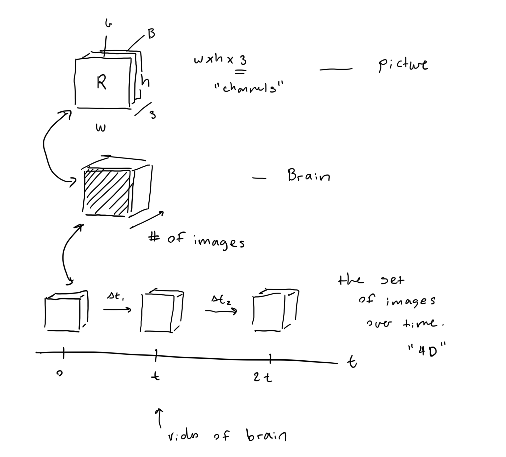

## Data

Main model takes in 4D Brain data

## Pipeline

There is a preprocess pipeline in order to process a 4D brain tensor into valid data to be processed by each individual model that we have in the main statistical model.

## Different Models

- [Alzheimers](ALZHEIMERS.md)
- [Autism](AUTISM.md)
- [Tumor](TUMOR.md)
- [Schizophrenia](SCHIZOPHRENIA.md)

## Main

How the main model works: the main model is based off a paper by Yang, Natarajan, et. al. "Knowledge intensive learning" and combines outputs of various individual models given independence of causual influences we can combine the outputs of our various models using the Noisy-OR statistical model.

## Citations

[1] Yang, S., & Natarajan, S. (2013, September). Knowledge intensive learning: Combining qualitative constraints with causal independence for parameter learning in probabilistic models. In Joint European Conference on Machine Learning and Knowledge Discovery in Databases (pp. 580-595). Springer, Berlin, Heidelberg.