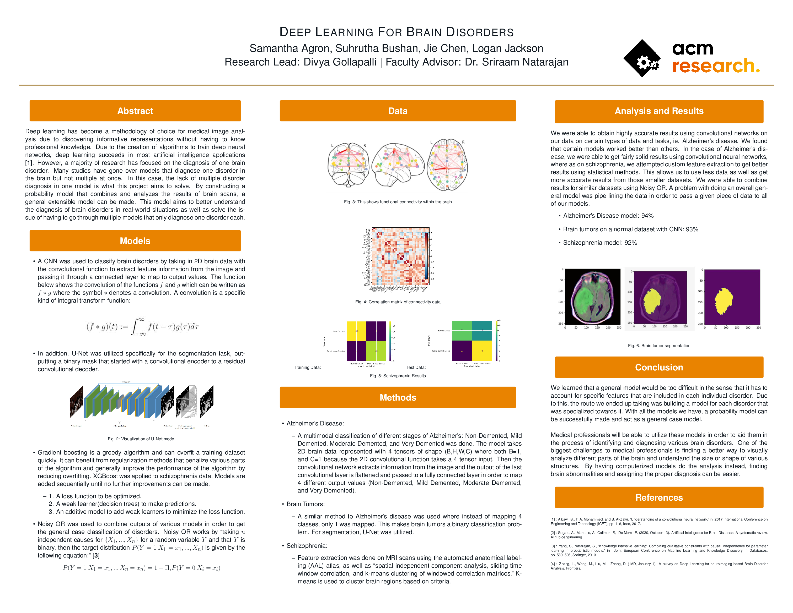
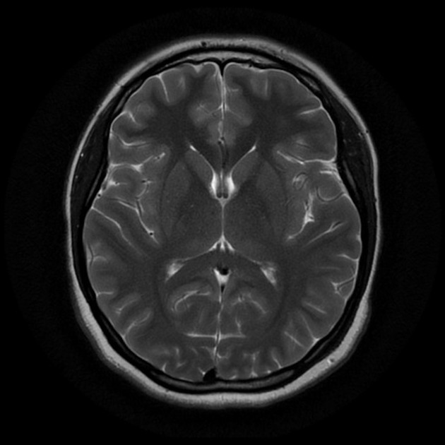
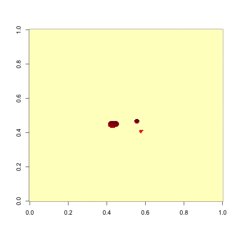
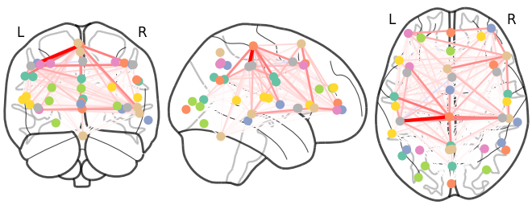

# Deep Learning For Brain Disorders

**ACM Research, Fall 2021**

## Abstract

Deep learning has become a methodology of choice for medical image analysis due to discovering informative representations without having to know professional knowledge. Due to the creation of algorithms to train deep neural networks, deep learning succeeds in many artificial intelligence applications [1]. 
However, a majority of research has focused on the diagnosis of one brain disorder. Many studies have gone over models that diagnose one disorder in the brain but not multiple at once. In this case, the lack of multiple disorder diagnosis in one model is what this project aims to solve. 
By constructing a probability model that combines and analyzes the results of brain scans, a general extensible model can be made. This model aims to better understand the diagnosis of brain disorders in real-world situations as well as solve the issue of having to go through multiple models that only diagnose one disorder each.
Our research attempts to propose a vector for future research in creating more generalized models for brain disorder diagnosis.

## Data

- 2D Brain Data: individual cross sections of the brain
     
    
- 3D Brain Data: series of cross sections that represent a volume of brain
     
    
- 4D Brain Data: series of 3D brains over time this was useful extracting connectome information
     
    

## Models

- Various CNNs
  - A CNN was used to classify brain disorders by taking in 2D brain data with the convolutional function to extract feature information from the image and passing it through a connected layer to map to output values. 
  - In addition, U-Net was utilized specifically for the segmentation task, outputting a binary mask that started with a convolutional encoder to a residual convolutional decoder.
- XGBOOST
  - Gradient boosting is a greedy algorithm and can overfit a training dataset quickly. It can benefit from regularization methods that penalize various parts of the algorithm and generally improve the performance of the algorithm by reducing overfitting. XGBoost was applied to schizophrenia data. Models are added sequentially until no further improvements can be made.
- AugmentedOr
  - Noisy OR was used to combine outputs of various models in order to get the general case classification of disorders.

## Methods

- Alzheimer's Disease
  - A multimodal classification of different stages of Alzheimer’s: Non-Demented, Mild Demented, Moderate Demented, and Very Demented was done. The model takes 2D brain data represented with 4 tensors of shape (B,H,W,C) where both B=1, and C=1 because the 2D convolutional function takes a 4 tensor input. Then the convolutional network extracts information from the image and the output of the last convolutional layer is flattened and passed to a fully connected layer in order to map 4 different output values (Non-Demented, Mild Demented, Moderate Demented, and Very Demented).
- Brain Tumors
  - A similar method to Alzheimer's disease was used where instead of mapping 4 classes, only 1 was mapped. This makes brain tumors a binary classification problem. For segmentation, U-Net was utilized.
- Schizophrenia 
  - Feature extraction was done on MRI scans using the automated anatomical labeling (AAL) atlas, as well as spatial independent component analysis, sliding time window correlation, and k-means clustering of windowed correlation matrices. K-means is used to cluster brain regions based on criteria.

## Results

- ALZHEIMER'S DISEASE: 94%
- BRAIN TUMORS: 93%
- SCHIZOPHRENIA: 92% 
- COMBINED/ENSEMBLE: >70%

## Conclusions

Limited datasets led to the models for individual disorders being overfit. The lower performance on the combined model was likely due to the overfitting or mislearning of the combined model F function. The new models didn't have much time to be trained so while there was better generalization, there was lower accuracy.

We were able to obtain highly accurate results using convolutional networks on our data on certain types of data and tasks, ie. Alzheimer's disease. We found that certain models worked better than others. In the case of Alzheimer's disease, we were able to get fairly solid results using convolutional neural networks, where as on schizophrenia, we attempted custom feature extraction to get better results using statistical methods. This allows us to use less data as well as get more accurate results from those smaller datasets. We were able to combine results for similar datasets using Noisy OR. A problem with doing an overall general model was pipe lining the data in order to pass a given piece of data to all of our models.

## Contributors

Participants
- [Samantha Agron](https://github.com/sagron16) 
- [Suhrutha Bushan](https://github.com/suhrutha618)
- [Jie Chen](https://github.com/Wnedyz)
- [Logan Jackson](https://github.com/LoganLieou)

Research Lead
- [Divya Gollapalli](https://github.com/divya-g-248) 

Faculty Advisor
- [Dr. Sriraam Natarajan](https://personal.utdallas.edu/~sriraam.natarajan/)

## References

[1] : Albawi, S., T.~A. Mohammed, and S.~Al-Zawi, ''Understanding of a convolutional neural network,'' in { 2017 International Conference on Engineering and Technology (ICET)}, pp.~1--6, Ieee, 2017.

[2] : Segato, A., Marzullo, A., Calimeri, F., & De Momi, E. (2020, October 13). Artificial Intelligence for Brain Diseases: A systematic review. APL bioengineering.

[3] : Yang, S., Natarajan, S., ''Knowledge intensive learning: Combining qualitative constraints with causal independence for parameter learning in probabilistic models,'' in { Joint European Conference on Machine Learning and Knowledge Discovery in Databases}, pp.~580--595, Springer, 2013.

[4] : Zhang, L., Wang, M., Liu, M., & Zhang, D. (1AD, January 1). A survey on Deep Learning for neuroimaging-based Brain Disorder Analysis. Frontiers.
